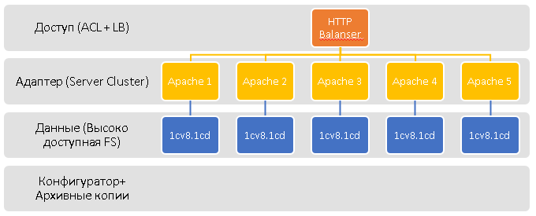

# Кластер 1С для "нищебродов"

[](https://gitter.im/silverbulleters/vanessa-nishebrod-cluster?utm_source=share-link&utm_medium=link&utm_campaign=share-link)
[](https://travis-ci.org/silverbulleters-research/vanessa-nishebrod-cluster)

* Если у вас нет сервера 1С или денег на сервер 1С.
* А обеспечить высокую доступность хочется то этот репозиторий для вас
* Также данный репозиторий является обучающим - дающим понимание по концепции `NoOps` для интересующихся 1С-ников

## Использование

посмотрите вебинар https://infostart.ru/webinars/564264/ (платный) - можно и не смотреть, но тогда разбираться придется самому

* скачайте и установить `packer` и `terraform` (крайне желательно - последние версии)
* создайте и заполните файл с Вашими логинами и паролями и версией платформы
  * файл `.env` в git не попадает, как заполнять смотрите `.env.example`
* запустите `pack.sh` - соберется образ операционной системы
* запустите `start.sh` - развернуется полный кластер в Digital OCean
* по указанному IP адресу подключить удаленный диск в Windows (Linux)
* зайдите 1C:Конфигуратором в базу (или используйте `deployka`)
* установите свою конфигурацию (Тест Гилева, БСП, Fragtest, БП 3.0, УТ 11.2, ЗУП 3.0) и обновите БД.
* создайте пользователей в Конфигураторе если это необходимо
* заходите по адресу http://IP/ и `работайте в 1С ;-)`

## Командная строка

если у вас нет `git` (git for windows) или `conemu` и `far` для Windows - здесь для Вас слишком много магии

### Инсталяция

под администратором Windows (для nix используем положенные пакетные менеджеры)

```
choco install packer
choco install terraform
```

## Конфигурирование

в unix

```
cp .env.example .env
nano .env
```

## Запуск

в режиме `bash` (не забываем про файл `.env`)

```
./pack.sh
./start.sh
```

указанный IP файл - это ваш кластер - пользуйтесь

## Используемые технологии

* `packer` - чтобы сделать готовый образ (например для Digital Ocean) https://www.packer.io/downloads.html 
* `terraform` - чтобы запускать и обновлять Кластер https://www.terraform.io/
* `docker` - чтобы объединять и связывать сервисы https://www.docker.com/

## Docker контейнеры и docker технологии

* `membrane-soa` - балансировщик и service proxy (HA-Proxy и nginx не использовали специально, даже не предлагайте).
* `vanessa-apache` - Web адаптер 1С. Используйтся 5 контуров Apache
* `webdav` - доступ 1С:Конфигуратора по протоколу WebDav

## Легальность использования

* используется клиентские лицензии 1С - поэтому при доступе по Web ссылке вы используете локальный ключ. Как минимум ключ для обучения программирования
* созданные контейнеры с 1С+Apache содержать пакеты компании 1С (с) поэтому НЕ надо публиковать этот образ на `hub.docker.com` в публичном режиме, используйте закрытые docker хабы к которым имеете доступ только Вы

## Если хотите попробовать

* используйте реферальную ссылку Digital Ocean https://m.do.co/c/2a3a0769ac84 - получите облачный сервер на 10$
* войдите в чат Giier [](https://gitter.im/silverbulleters/vanessa-nishebrod-cluster?utm_source=share-link&utm_medium=link&utm_campaign=share-link) и задайте вопрос
* если в Gitter чате никто не ответил - читайте документацию до конца и делайте `pull-request'ы`

## Доработка

* используйте GitHub-Flow и подавайте `pull-request'ы`
* проверки качества - после согласования вашей доработки мы еще используем CI-CD [](https://travis-ci.org/silverbulleters-research/vanessa-nishebrod-cluster)

## Лицезия на проект

Apache 2.0

## Про "нищебродство" и GitHub Issues

если кому-то стало обидно от этого наименования, то вы должны знать что мы используем указанный проект на UAT контурах при имплементации инженерных практик, а так как у нас нет денег на покупку большого количества "мини-серверов" 1С - то "нищебродами" мы называем себя сами. Если у вас это вызывает "проблемы" - это Ваши личные трудности ;-).

среди 1С-ников распространена концепция "много разговаривать - мало кодить", поэтому Issue отключены - мы и сами знаем что делать, если хотите поучаствовать: изучить GitHub CLA и делайте pull-request'ы


